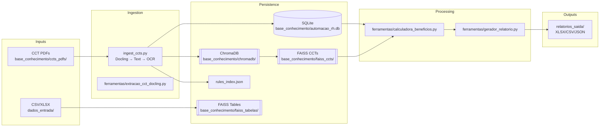
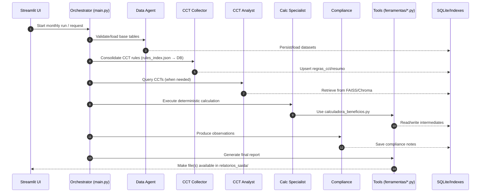

# Automação RH - Agentes

Sistema multiagentes para cálculo de VR/VA orquestrado por um "Gerente" (orquestrador) e especialistas, com painel em Streamlit para operação e revisão.

## Sumário

- [Estrutura](#estrutura)
- [Visão Geral (PT-BR)](#visão-geral-pt-br)
  - [Arquitetura em alto nível](#arquitetura-em-alto-nível)
  - [Agentes & Responsabilidades](#agentes--responsabilidades)
  - [Regras determinísticas (resumo)](#regras-determinísticas-resumo)
  - [Páginas do dashboard (como usar)](#páginas-do-dashboard-como-usar)
  - [Prompts & LLM](#prompts--llm)
  - [Embeddings & Índices Vetoriais](#embeddings--índices-vetoriais)
  - [Setup](#setup)
  - [Execução](#execução)
  - [Guias rápidos](#guias-rápidos)
  - [Troubleshooting](#troubleshooting)
- [Project Overview (English)](#project-overview-english)
  - [Architecture at a glance](#architecture-at-a-glance)
  - [Agents & Responsibilities](#agents--responsibilities)
  - [Deterministic Rules (summary)](#deterministic-rules-summary)
  - [UI Pages (how to)](#ui-pages-how-to)
  - [Prompts & LLM](#prompts--llm-1)
  - [Embeddings & Indexes](#embeddings--indexes)
  - [Setup](#setup-1)
  - [Running](#running)
  - [Quick Guides](#quick-guides)
  - [Troubleshooting](#troubleshooting-1)

## Estrutura
Pastas principais neste repositório:
- `dados_entrada/`: arquivos base (Excel/CSV) enviados pelo usuário
- `relatorios_saida/`: relatórios e artefatos gerados (XLSX/CSV/JSON)
- `ferramentas/`: ferramentas de cálculo e utilitários (ex.: `calculadora_beneficios.py`)

---

# Visão Geral (PT-BR)

Este projeto automatiza o cálculo de VR/VA com uma pipeline multiagentes, um motor determinístico e um dashboard em Streamlit para operação, auditoria e testes rápidos (what‑if).

## Arquitetura em alto nível

- Camadas
  - Apresentação: `streamlit_app.py` (dashboard Streamlit)
  - Orquestração/Agentes: `agentes/`, prompts em `prompts/`
  - Domínio/Negócio: `ferramentas/*.py` (cálculo determinístico, gerador de relatório, extração de CCT)
  - Persistência: SQLite em `base_conhecimento/automacao_rh.db`, índices vetoriais em `base_conhecimento/faiss_*`, ChromaDB em `base_conhecimento/chromadb/`
  - Ingestão: `ingest_ccts.py`, utilidades em `utils/`

- Diretórios de dados
  - Entradas: `dados_entrada/` (CSV/XLSX)
  - PDFs de CCT: `base_conhecimento/ccts_pdfs/`
  - Saídas: `relatorios_saida/` (XLSX/CSV/JSON)
  - Embeddings locais: `models/` (Sentence-Transformers)

## Agentes & Responsabilidades

- Orquestrador: coordena agentes e ferramentas
- Agente de Dados: valida e prepara bases (página 1)
- Coletor CCT: consolida extrações em `rules_index.json` e resumos no SQLite
- Analista CCT: responde dúvidas usando os índices FAISS/Chroma
- Resolvedor VR/VA: decide a fonte do valor (Overrides → OCR/Index CCT → planilha Estado opcional → Padrão)
- Compliance: gera observações (exibidas em `relatorios_saida/compliance.txt`)
- Motor Determinístico: aplica competência, exclusões, proporcionalidades e totais

## Regras determinísticas (resumo)

- Exclusões: diretoria, estagiários, aprendizes, exterior, “afastado” heurístico
- Admissões-only (Status col. D vazio): conta como ativo (UF padrão RS quando ausente)
- Desligamentos:
  - Com OK ≤ dia 15: exclui
  - Sem OK: proporcional (se admitido no mês → limita ao dia 15; senão usa data de desligamento)
- Férias/Afastamentos:
  - Intervalos de datas subtraem dias úteis
  - Apenas “N dias” sem datas → bloco sintético subtraindo N dias úteis a partir do início
- Dias úteis por UF: `utils/calendario.py`, respeita a competência global
- Financeiro: TOTAL = DIAS × VR_DIA; empresa 80% / empregado 20%
- Prioridade da fonte de valor: Override → OCR/Index CCT → planilha Estado/Valor (opcional) → `VALOR_PADRAO`

## Páginas do dashboard (como usar)

- 0‑Mês Competência: define mês/ano e faixa de dias; valores alimentam a página 7
- 1‑Importar Relatórios Base: faz upload para `dados_entrada/`; validação rápida; carga opcional no SQLite
- 2‑Importar CCTs:
  - Envie PDFs para `base_conhecimento/ccts_pdfs/`
  - Rodar ingestão (Docling → texto → OCR)
  - 2.2 Chat com CCTs: indexa PDFs em FAISS (`base_conhecimento/faiss_ccts/`) e permite perguntas
- 3‑Validação de Regras CCT: registre Overrides (têm prioridade)
- 4‑Cadastro de Feriados: mantém feriados por UF
- 5‑Prompts: edite os `.md` de agentes
- 7‑Dados Finais:
  - 7.1 Geração de VR/VA/Consolidado
  - 7.2 Visualização do Banco (SQLite)
  - 7.3 Chat com Dados: indexa CSV/XLSX no FAISS (`base_conhecimento/faiss_tabelas/`) e permite perguntas

## Prompts & LLM

- Provedor/modelo/temperatura do LLM configurados na sidebar (aplicam‑se às respostas; embeddings são locais)
- Prompts dos chats são externos e editáveis:
  - `prompts/chat_cct.md`
  - `prompts/chat_dados.md`
- O histórico é injetado como `{chat_history}`; contexto de recuperação como `{context}`; pergunta atual como `{question}`

## Embeddings & Índices Vetoriais

- Embeddings: Sentence‑Transformers locais em `models/` (padrão `sentence-transformers/all-MiniLM-L6-v2`)
- Download do modelo: botão na UI executa `download_model.py`
- Índice CCTs (FAISS): `base_conhecimento/faiss_ccts/`
- Índice Tabelas (FAISS): `base_conhecimento/faiss_tabelas/`
- Observações do índice de tabelas:
  - CSV/XLSX lidos com `dtype=str` para preservar zeros à esquerda
  - XLSX: todas as abas são lidas; `source` registrado como `arquivo.xlsx#Aba`
  - Reindexação automática quando a lista de arquivos muda

## Setup

1) Python 3.11+
2) `pip install -r requirements.txt`
3) Se faltar o modelo de embeddings, use o botão no Chat CCT para baixar
4) Chaves de LLM opcionais: sidebar ou `.env`

## Execução

```bash
streamlit run streamlit_app.py
```

## Guias rápidos

- Chat CCT
  - Coloque PDFs em `base_conhecimento/ccts_pdfs/`
  - Clique “Indexar/Atualizar CCTs” → faça perguntas (fontes exibidas)

- Chat Dados
  - Coloque CSV/XLSX em `dados_entrada/`
  - Clique “Indexar/Atualizar Dados Importados” → faça perguntas (fontes exibidas)

- Geração VR/VA
  - Defina competência na página 0
  - Na página 7, execute “Executar e Gerar Relatório”

## Troubleshooting

- Embeddings: garanta `sentence-transformers` e `faiss-cpu` instalados; embeddings forçados para CPU no código
- Pip resolver/hashes: `pip cache purge` e instalar com `--no-cache-dir`
- Avisos `use_container_width`: cosméticos; migrar depois para `width='stretch'`

# Diagramas (Mermaid)

Os diagramas abaixo também estão versionados em `docs/architecture.mmd`.

### Fluxo de Dados



### Comunicação entre Agentes



### Fluxo Visual (UI)

```mermaid
flowchart TB
  subgraph Sidebar
    SB1[LLM Provider/Model/Temp]
  end

  subgraph UI[Streamlit Pages]
    P0[0 - Mês Competência\nSet window (YYYY-MM, day range)]
    P1[1 - Importar Relatórios Base\nUpload CSV/XLSX, SQLite load]
    P2[2 - Importar CCTs\nUpload PDFs, Ingest]
    P22[2.2 - Chat com CCTs\nBuild/Use FAISS CCTs]
    P3[3 - Validação de Regras CCT\nRegister Overrides]
    P4[4 - Cadastro de Feriados\nManage holidays by UF]
    P5[5 - Prompts\nEdit prompts/*.md]
    P7[7 - Dados Finais\nRun calc, DB viewer, Data Chat]
  end

  SB1 --- P22
  SB1 --- P7

  P0 --> P7
  P1 --> P7
  P2 --> P22
  P2 --> P3
  P22 --> P7
  P3 --> P7
  P4 --> P7
  P5 --> P7

  P7 -->|Generate| OUT[relatorios_saida/]
```

# Project Overview (English)

This project automates VR/VA calculation using a multi-agent pipeline, a deterministic engine, and a Streamlit dashboard for operations, audit, and what‑if analysis.

## Architecture at a glance

- Application layers
  - Presentation: `streamlit_app.py` (Streamlit dashboard)
  - Orchestration/Agents: `agentes/`, prompts in `prompts/`
  - Domain/Business: `ferramentas/*.py` (deterministic calculator, report generator, CCT extraction)
  - Persistence: SQLite at `base_conhecimento/automacao_rh.db`, FAISS at `base_conhecimento/faiss_*`, ChromaDB at `base_conhecimento/chromadb/`
  - Ingestion: `ingest_ccts.py`, utilities in `utils/`

- Data directories
  - Inputs: `dados_entrada/` (CSV/XLSX)
  - CCT PDFs: `base_conhecimento/ccts_pdfs/`
  - Outputs: `relatorios_saida/` (XLSX/CSV/JSON)
  - Local embeddings: `models/` (Sentence-Transformers)

## Agents & Responsibilities

- Orchestrator (main): coordinates specialized agents and tools
- Data Agent: validates and prepares base files (page 1)
- CCT Collector: consolidates extractions into `rules_index.json` and SQLite summaries
- CCT Analyst: answers CCT-specific questions using FAISS/Chroma indexes
- VR/VA Resolver: selects value source (Overrides → CCT OCR/Index → optional State sheet → Default)
- Compliance: emits observations (`relatorios_saida/compliance.txt`)
- Deterministic Engine: applies competence window, exclusions, proportionalities and totals

## Deterministic Rules (summary)

- Exclusions: directors, interns, apprentices, abroad, heuristic away (“afastado”)
- Admissions-only (Status col. D empty): included as active (UF default RS if missing)
- Terminations: OK ≤ 15 → excluded; else proportional (if admitted in month → clamp to 15; else termination date)
- Vacations/Away: date ranges subtract business days; only N-without-dates → synthetic block from window start
- Business days by UF via `utils/calendario.py`
- Financials: TOTAL = DIAS × VR_DIA; company 80% / employee 20%
- Value priority: Overrides → CCT OCR/Index → State sheet (optional) → `VALOR_PADRAO`

## UI Pages (how to)

- 0-Mês Competência: set month/year and day range
- 1-Importar Relatórios Base: upload to `dados_entrada/` and optionally load into SQLite
- 2-Importar CCTs: upload PDFs, run ingestion; 2.2 CCT Chat builds FAISS and answers
- 3-Validação de Regras CCT: register Overrides
- 4-Cadastro de Feriados: maintain holidays by UF
- 5-Prompts: edit agent prompts
- 7-Dados Finais: generation, DB viewer, Data Chat (FAISS over tables)

## Prompts & LLM

- Provider/model/temperature set in sidebar (applies to answers, not embeddings)
- External chat prompts: `prompts/chat_cct.md` and `prompts/chat_dados.md`
- Templates receive `{context}`, `{chat_history}`, `{question}`

## Embeddings & Indexes

- Local Sentence-Transformers in `models/` (default `sentence-transformers/all-MiniLM-L6-v2`)
- Download via button running `download_model.py`
- FAISS indexes: CCTs → `base_conhecimento/faiss_ccts/`, Tables → `base_conhecimento/faiss_tabelas/`
- Tables notes: CSV/XLSX read with `dtype=str`; all sheets; `file.xlsx#Sheet`; auto rebuild on file changes

## Setup

1) Python 3.11+
2) `pip install -r requirements.txt`
3) If embeddings model missing, use the CCT Chat button
4) Optional LLM keys via sidebar or `.env`

## Running

```bash
streamlit run streamlit_app.py
```

## Quick Guides

- CCT chat: put PDFs in `base_conhecimento/ccts_pdfs/` → index → ask
- Data chat: put CSV/XLSX in `dados_entrada/` → index → ask
- Generate VR/VA: set competence (page 0) → run in page 7

## Troubleshooting

- Embeddings: ensure `sentence-transformers` and `faiss-cpu`; embeddings forced to CPU
- Pip cache/hashes: `pip cache purge` and reinstall with `--no-cache-dir`
- Streamlit deprecations: replace `use_container_width` with `width='stretch'` when convenient

## Setup
1) Crie o ambiente virtual:
```
python3 -m venv .venv
source .venv/bin/activate  # Linux/Mac
```
2) Instale dependências:
```
pip install -r requirements.txt
```
3) Variáveis de ambiente e modelo (dotenv):
   - Copie `.env.example` para `.env` e preencha:
```
cp .env.example .env
```
   - Campos:
     - `GOOGLE_API_KEY`: chave da API do Google Gemini
     - `GENAI_MODEL`: ex. `gemini-2.5-pro`
     - `GENAI_TEMPERATURE`: ex. `0.2`
     - `LLM_PROVIDER`: `google` (padrão) ou `groq`
     - `GROQ_API_KEY`: chave da API da Groq (quando `LLM_PROVIDER=groq`)
     - `GROQ_MODEL`: ex. `llama-3.1-70b-versatile`

## Execução
Você pode executar por linha de comando ou via Dashboard (recomendado).

### Via linha de comando
Após preencher os prompts e configurar os agentes, rode:
```
python3 main.py
```

### Via Dashboard (Streamlit)
Inicie a aplicação web:
```
streamlit run streamlit_app.py
```
No app, utilize as páginas à esquerda:

## Comunicação entre Componentes
- __Ingestão → Banco__: `ingest_ccts.py` cria/atualiza `regras_cct` com upsert por `arquivo` e logs de origem (`docling_table`, `docling_text`, `text_fallback`, `docling_error:*`).
- __Streamlit → Banco__: leitura das tabelas (inclui `regras_cct`) e dos artefatos em `relatorios_saida/` para exibir métricas e permitir ações.
- __Ferramentas (`@tool`) → Banco__: `salvar_dataframe_db` e `carregar_dataframe_db` para pipelines auxiliares.
- __Agentes → Ferramentas__: agentes invocam ferramentas para cálculos, leitura de dados e geração de relatórios.
- __ChromaDB__: conteúdo de CCTs é indexado para futuras consultas/contexto (coleção `ccts`).
- Importar Relatórios Base: upload para `dados_entrada/` e botão “Carregar tudo no SQLite”.
  - Inclui a seção “Validação rápida inserção de dados no banco de dados”, que mostra:
    - Diagnóstico de bases detectadas
    - Amostras e contagem de linhas (quando possível)
- Importar CCTs: envie PDFs para `base_conhecimento/ccts_pdfs/` e rode a ingestão.
- Prompts: edite os prompts `.md` dos agentes.
- Dashboard: execute a orquestração, veja status/checagens e gere o relatório VR com nome de arquivo personalizável.

### Ingestão das CCTs (preparação one-off)
1) Coloque PDFs em `base_conhecimento/ccts_pdfs/`
2) Execute:
```
python3 ingest_ccts.py
```

#### OCR automático (CCTs digitalizadas)
- O `ingest_ccts.py` usa PyMuPDF para extrair texto. Se a página tiver pouco texto, faz fallback para OCR com Tesseract.
- Pré-requisito no Linux (exemplos):
  - Ubuntu/Debian: `sudo apt-get update && sudo apt-get install -y tesseract-ocr tesseract-ocr-por`
  - Arch: `sudo pacman -S tesseract tesseract-data-por`
- Python deps já inclusas: `pytesseract` e `Pillow`.
- Metadados: o script infere a UF a partir do nome do arquivo ou do texto e salva em `metadatas["uf"]` para consultas por estado.

> Observação: a ingestão é uma etapa de preparação. Rode novamente somente quando adicionar novas CCTs.

## Extração VR/VA (Docling + fallback)
- O pipeline de ingestão (`ingest_ccts.py`) agora utiliza, em ordem:
  1) Docling para converter PDF e preservar estrutura de tabelas/texto.
  2) Fallback robusto por texto (PyMuPDF/pdfplumber) e, se necessário, OCR (Tesseract).

- Detecções implementadas:
  - VR (Vale-Refeição) e VA (Vale-Alimentação) com sinônimos regionais:
    - VR: "Ticket Refeição", "Cartão Refeição", "Benefício Refeição", "Refeição Convênio".
    - VA: "Ticket Alimentação", "Cartão Alimentação", "Cesta Básica", "Auxílio Cesta", "Alimentação Convênio".
  - Periodicidade: "por dia"/"diário"/"ao dia" → diário; "por mês"/"mensal"/"ao mês" → mensal.
  - Condição: expressões como "comunicado até o dia 15" → "comunicado <= 15".

- Normalização:
  - Valores monetários são convertidos para float (`vr_float`, `va_float`). Percentuais permanecem sem conversão.

## Banco de dados (SQLite)
- Tabela criada/atualizada automaticamente: `regras_cct` em `base_conhecimento/automacao_rh.db`.
- Colunas: `arquivo` (PK), `uf`, `sindicato`, `vr`, `vr_float`, `va`, `va_float`, `origem`, `periodicidade`, `condicao`.
- Índices:
  - `CREATE INDEX IF NOT EXISTS idx_regras_cct_arquivo ON regras_cct(arquivo);`
  - `CREATE INDEX IF NOT EXISTS idx_regras_cct_uf ON regras_cct(uf);`
  - `CREATE INDEX IF NOT EXISTS idx_regras_cct_sindicato ON regras_cct(sindicato);`

Exemplo de consulta:
```sql
SELECT arquivo, uf, sindicato, vr, vr_float, va, va_float, origem, periodicidade, condicao
FROM regras_cct
ORDER BY arquivo;
```

## Componentes principais
- `utils/config.py`: carrega `.env` e fornece `get_llm()` (Gemini via LangChain ou Groq via LangChain, conforme `LLM_PROVIDER`).
- `agentes/*`: agentes usam o LLM e prompts carregados de `prompts/`.
- `ferramentas/*`: ferramentas (LangChain `@tool`) para leitura, cálculo e relatório.

## Dashboard: status, validações e geração do VR
- Tabela de status simples por agente/ação.
- “Checks de Validação da Execução” lendo `relatorios_saida/resultado_execucao.json`.
- “Gerar VR Mensal (com fallback por UF → Estado)” com:
  - Campo de competência `YYYY-MM`
  - Campo “Nome do arquivo de exportação” para escolher o nome do XLSX
  - Botão “Gerar Relatório VR” seguido de “Baixar Relatório VR”

### Regras CCT: Resumo consolidado (Coletor CCT)
- Página "Regras CCT" mostra uma grade lendo `regras_cct_resumo` (SQLite):
  - Filtros por `UF` e `Sindicato`.
  - Destaque visual de pendências: `pendencia_valores`, `pendencia_dias`, `pendencia_clausulas`.
  - Use esta visão para auditar rapidamente lacunas e decidir entre override manual ou Base Manual/Estado.

## Saídas geradas
Arquivos em `relatorios_saida/`:
- `VR_MENSAL_mm_aaaa_CALC.xlsx` ou o nome customizado definido no Dashboard.
- `VR_MENSAL_mm_aaaa_ERROS.csv` quando houver linhas sem valor aplicado (amostra para revisão).
- `resultado_execucao.json` e `progresso_execucao.jsonl` (histórico/validações do workflow).

## Dependências
Arquivo chave:
- `requirements.txt` inclui: pandas, openpyxl, langchain, google-generativeai, langchain-google-genai, chromadb, pymupdf, python-dotenv, langchain-groq, pytesseract, Pillow, streamlit, docling.

### Principais libs por camada
- __Ingestão/Extração__:
  - Docling (`docling`)
  - PyMuPDF (`pymupdf`), pdfplumber (`pdfplumber`)
  - OCR: Tesseract (`pytesseract`, `Pillow`, OpenCV `opencv-python`)
- __Persistência__:
  - SQLite (padrão Python), Pandas (`pandas`) para I/O tabular
  - ChromaDB (`chromadb`) para índice vetorial
- __Orquestração/IA__:
  - LangChain (`langchain`), Google GenAI (`google-generativeai`, `langchain-google-genai`), Groq (`langchain-groq`)
- __UI__:
  - Streamlit (`streamlit`)

> Observação: percentuais de VR/VA são mantidos como texto; floats são populados apenas para valores monetários.

> Pré-requisitos de sistema (OCR): instalar Tesseract e o pacote de idioma PT-BR, conforme exemplos acima.
