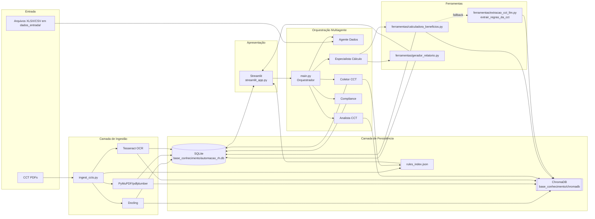

# Automação RH - Agentes

Sistema multiagentes para cálculo de VR/VA orquestrado por um "Gerente" (orquestrador) e especialistas, com painel em Streamlit para operação e revisão.

## Estrutura
Pastas principais neste repositório:
- `dados_entrada/`: arquivos base (Excel/CSV) enviados pelo usuário
- `relatorios_saida/`: relatórios e artefatos gerados (XLSX/CSV/JSON)
- `ferramentas/`: ferramentas de cálculo e utilitários (ex.: `calculadora_beneficios.py`)
- `utils/`: helpers (calendário, carregamento de prompts, config)
- `agentes/` e `prompts/`: definição dos agentes e prompts

## Arquitetura do Sistema
- __[Camada de Ingestão de CCTs]__ (`ingest_ccts.py`):
  - Extrai texto e tabelas das CCTs com ordem de prioridade: Docling → PyMuPDF/pdfplumber → OCR (Tesseract).
  - Resolve VR/VA, normaliza valores para float, detecta `periodicidade`/`condicao`, e persiste no SQLite.
  - Indexa conteúdo em ChromaDB para buscas/contexto futuro.
- __[Camada de Persistência]__ (`base_conhecimento/automacao_rh.db`, `ferramentas/persistencia_db.py`):
  - Tabela `regras_cct` com colunas: `arquivo`, `uf`, `sindicato`, `vr`, `vr_float`, `va`, `va_float`, `origem`, `periodicidade`, `condicao`.
  - Ferramentas utilitárias para salvar/carregar DataFrames via `@tool`.
- __[Camada de Lógica/Negócio]__ (`ferramentas/*.py`):
  - `calculadora_beneficios.py`: cálculos de VR mensal, etc.
  - `gerador_relatorio.py`: composição dos relatórios finais.
  - `extracao_cct_docling.py`: extração estruturada VR/VA + heurísticas.
- __[Camada de Orquestração Multiagente]__ (`agentes/`, `prompts/`, `main.py`):
  - Orquestra agentes especialistas (Dados, Coletor CCT, Analista CCT, Compliance, Cálculo) dirigidos por prompts.
  - Novo agente determinístico: `Coletor CCT` (`agentes/coletor_cct.py`)
    - Consolida `rules_index.json` por `(UF, Sindicato)` em um resumo consistente.
    - Seleciona a melhor evidência (cláusulas explícitas > valores presentes > dias presentes).
    - Persiste em SQLite como `regras_cct_resumo` para auditoria e consumo no cálculo.
- __[Camada de Apresentação]__ (`streamlit_app.py`):
  - Dashboard para disparar ingestão, visualizar status, executar cálculo e baixar relatórios.

### Diagrama de Arquitetura



Fluxo alto nível:
1) PDFs → `ingest_ccts.py` → Docling/Texto/OCR → `regras_cct` + ChromaDB
2) Dados de entrada (XLSX/CSV) → SQLite
3) Orquestração/Agentes → `Dados` → `Coletor CCT` → `Analista CCT` → `Compliance` → `Cálculo` → `relatorios_saida/`
4) Streamlit consome SQLite/arquivos para visualização e ações

## Setup
1) Crie o ambiente virtual:
```
python3 -m venv .venv
source .venv/bin/activate  # Linux/Mac
```
2) Instale dependências:
```
pip install -r requirements.txt
```
3) Variáveis de ambiente e modelo (dotenv):
   - Copie `.env.example` para `.env` e preencha:
```
cp .env.example .env
```
   - Campos:
     - `GOOGLE_API_KEY`: chave da API do Google Gemini
     - `GENAI_MODEL`: ex. `gemini-2.5-pro`
     - `GENAI_TEMPERATURE`: ex. `0.2`
     - `LLM_PROVIDER`: `google` (padrão) ou `groq`
     - `GROQ_API_KEY`: chave da API da Groq (quando `LLM_PROVIDER=groq`)
     - `GROQ_MODEL`: ex. `llama-3.1-70b-versatile`

## Execução
Você pode executar por linha de comando ou via Dashboard (recomendado).

### Via linha de comando
Após preencher os prompts e configurar os agentes, rode:
```
python3 main.py
```

### Via Dashboard (Streamlit)
Inicie a aplicação web:
```
streamlit run streamlit_app.py
```
No app, utilize as páginas à esquerda:

## Comunicação entre Componentes
- __Ingestão → Banco__: `ingest_ccts.py` cria/atualiza `regras_cct` com upsert por `arquivo` e logs de origem (`docling_table`, `docling_text`, `text_fallback`, `docling_error:*`).
- __Streamlit → Banco__: leitura das tabelas (inclui `regras_cct`) e dos artefatos em `relatorios_saida/` para exibir métricas e permitir ações.
- __Ferramentas (`@tool`) → Banco__: `salvar_dataframe_db` e `carregar_dataframe_db` para pipelines auxiliares.
- __Agentes → Ferramentas__: agentes invocam ferramentas para cálculos, leitura de dados e geração de relatórios.
- __ChromaDB__: conteúdo de CCTs é indexado para futuras consultas/contexto (coleção `ccts`).
- Importar Relatórios Base: upload para `dados_entrada/` e botão “Carregar tudo no SQLite”.
  - Inclui a seção “Validação rápida inserção de dados no banco de dados”, que mostra:
    - Diagnóstico de bases detectadas
    - Amostras e contagem de linhas (quando possível)
- Importar CCTs: envie PDFs para `base_conhecimento/ccts_pdfs/` e rode a ingestão.
- Prompts: edite os prompts `.md` dos agentes.
- Dashboard: execute a orquestração, veja status/checagens e gere o relatório VR com nome de arquivo personalizável.

### Ingestão das CCTs (preparação one-off)
1) Coloque PDFs em `base_conhecimento/ccts_pdfs/`
2) Execute:
```
python3 ingest_ccts.py
```

#### OCR automático (CCTs digitalizadas)
- O `ingest_ccts.py` usa PyMuPDF para extrair texto. Se a página tiver pouco texto, faz fallback para OCR com Tesseract.
- Pré-requisito no Linux (exemplos):
  - Ubuntu/Debian: `sudo apt-get update && sudo apt-get install -y tesseract-ocr tesseract-ocr-por`
  - Arch: `sudo pacman -S tesseract tesseract-data-por`
- Python deps já inclusas: `pytesseract` e `Pillow`.
- Metadados: o script infere a UF a partir do nome do arquivo ou do texto e salva em `metadatas["uf"]` para consultas por estado.

> Observação: a ingestão é uma etapa de preparação. Rode novamente somente quando adicionar novas CCTs.

## Extração VR/VA (Docling + fallback)
- O pipeline de ingestão (`ingest_ccts.py`) agora utiliza, em ordem:
  1) Docling para converter PDF e preservar estrutura de tabelas/texto.
  2) Fallback robusto por texto (PyMuPDF/pdfplumber) e, se necessário, OCR (Tesseract).

- Detecções implementadas:
  - VR (Vale-Refeição) e VA (Vale-Alimentação) com sinônimos regionais:
    - VR: "Ticket Refeição", "Cartão Refeição", "Benefício Refeição", "Refeição Convênio".
    - VA: "Ticket Alimentação", "Cartão Alimentação", "Cesta Básica", "Auxílio Cesta", "Alimentação Convênio".
  - Periodicidade: "por dia"/"diário"/"ao dia" → diário; "por mês"/"mensal"/"ao mês" → mensal.
  - Condição: expressões como "comunicado até o dia 15" → "comunicado <= 15".

- Normalização:
  - Valores monetários são convertidos para float (`vr_float`, `va_float`). Percentuais permanecem sem conversão.

## Banco de dados (SQLite)
- Tabela criada/atualizada automaticamente: `regras_cct` em `base_conhecimento/automacao_rh.db`.
- Colunas: `arquivo` (PK), `uf`, `sindicato`, `vr`, `vr_float`, `va`, `va_float`, `origem`, `periodicidade`, `condicao`.
- Índices:
  - `CREATE INDEX IF NOT EXISTS idx_regras_cct_arquivo ON regras_cct(arquivo);`
  - `CREATE INDEX IF NOT EXISTS idx_regras_cct_uf ON regras_cct(uf);`
  - `CREATE INDEX IF NOT EXISTS idx_regras_cct_sindicato ON regras_cct(sindicato);`

Exemplo de consulta:
```sql
SELECT arquivo, uf, sindicato, vr, vr_float, va, va_float, origem, periodicidade, condicao
FROM regras_cct
ORDER BY arquivo;
```

## Componentes principais
- `utils/config.py`: carrega `.env` e fornece `get_llm()` (Gemini via LangChain ou Groq via LangChain, conforme `LLM_PROVIDER`).
- `agentes/*`: agentes usam o LLM e prompts carregados de `prompts/`.
- `ferramentas/*`: ferramentas (LangChain `@tool`) para leitura, cálculo e relatório.

## Dashboard: status, validações e geração do VR
- Tabela de status simples por agente/ação.
- “Checks de Validação da Execução” lendo `relatorios_saida/resultado_execucao.json`.
- “Gerar VR Mensal (com fallback por UF → Estado)” com:
  - Campo de competência `YYYY-MM`
  - Campo “Nome do arquivo de exportação” para escolher o nome do XLSX
  - Botão “Gerar Relatório VR” seguido de “Baixar Relatório VR”

### Regras CCT: Resumo consolidado (Coletor CCT)
- Página "Regras CCT" mostra uma grade lendo `regras_cct_resumo` (SQLite):
  - Filtros por `UF` e `Sindicato`.
  - Destaque visual de pendências: `pendencia_valores`, `pendencia_dias`, `pendencia_clausulas`.
  - Use esta visão para auditar rapidamente lacunas e decidir entre override manual ou Base Manual/Estado.

## Saídas geradas
Arquivos em `relatorios_saida/`:
- `VR_MENSAL_mm_aaaa_CALC.xlsx` ou o nome customizado definido no Dashboard.
- `VR_MENSAL_mm_aaaa_ERROS.csv` quando houver linhas sem valor aplicado (amostra para revisão).
- `resultado_execucao.json` e `progresso_execucao.jsonl` (histórico/validações do workflow).

## Dependências
Arquivo chave:
- `requirements.txt` inclui: pandas, openpyxl, langchain, google-generativeai, langchain-google-genai, chromadb, pymupdf, python-dotenv, langchain-groq, pytesseract, Pillow, streamlit, docling.

### Principais libs por camada
- __Ingestão/Extração__:
  - Docling (`docling`)
  - PyMuPDF (`pymupdf`), pdfplumber (`pdfplumber`)
  - OCR: Tesseract (`pytesseract`, `Pillow`, OpenCV `opencv-python`)
- __Persistência__:
  - SQLite (padrão Python), Pandas (`pandas`) para I/O tabular
  - ChromaDB (`chromadb`) para índice vetorial
- __Orquestração/IA__:
  - LangChain (`langchain`), Google GenAI (`google-generativeai`, `langchain-google-genai`), Groq (`langchain-groq`)
- __UI__:
  - Streamlit (`streamlit`)

> Observação: percentuais de VR/VA são mantidos como texto; floats são populados apenas para valores monetários.

> Pré-requisitos de sistema (OCR): instalar Tesseract e o pacote de idioma PT-BR, conforme exemplos acima.
